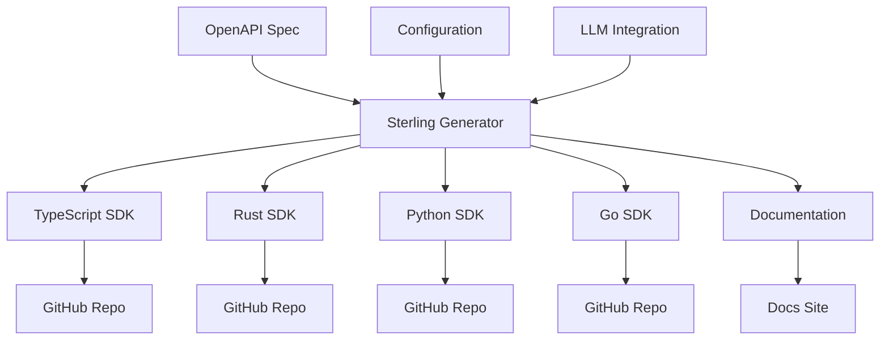
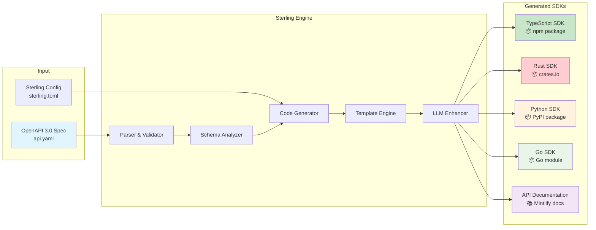
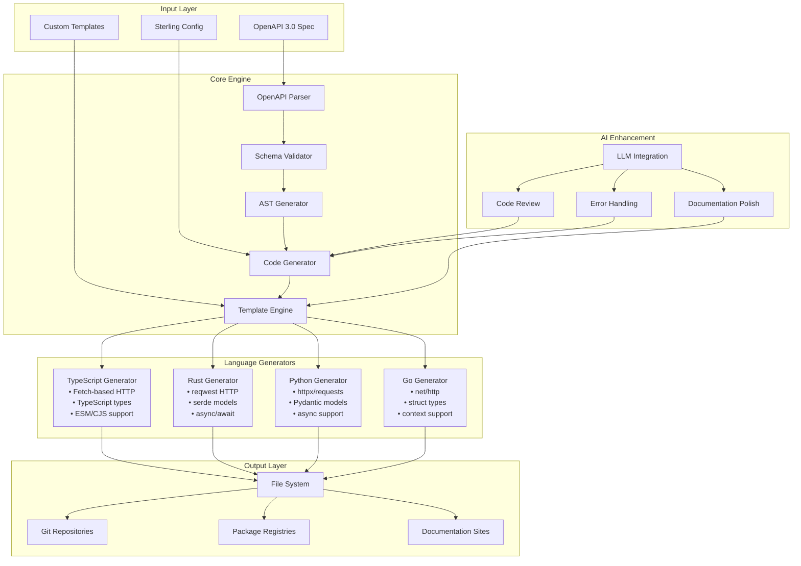
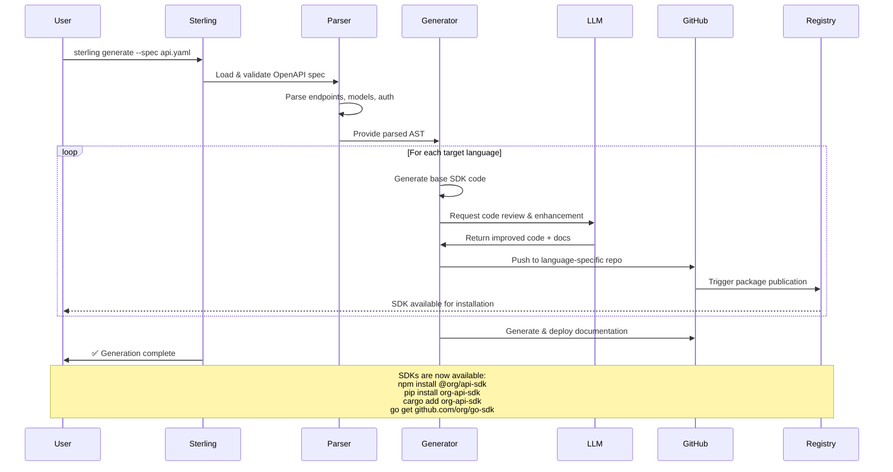
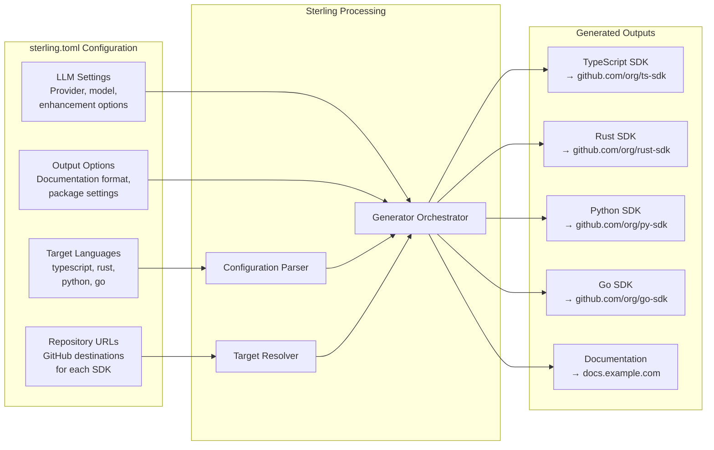
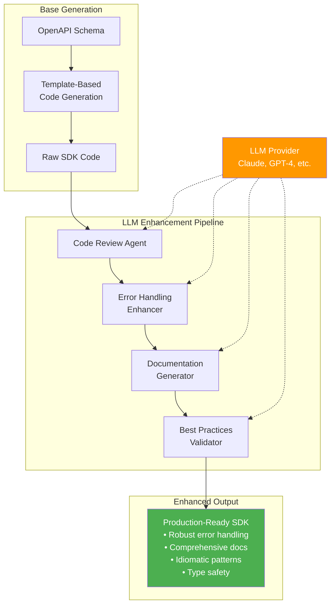
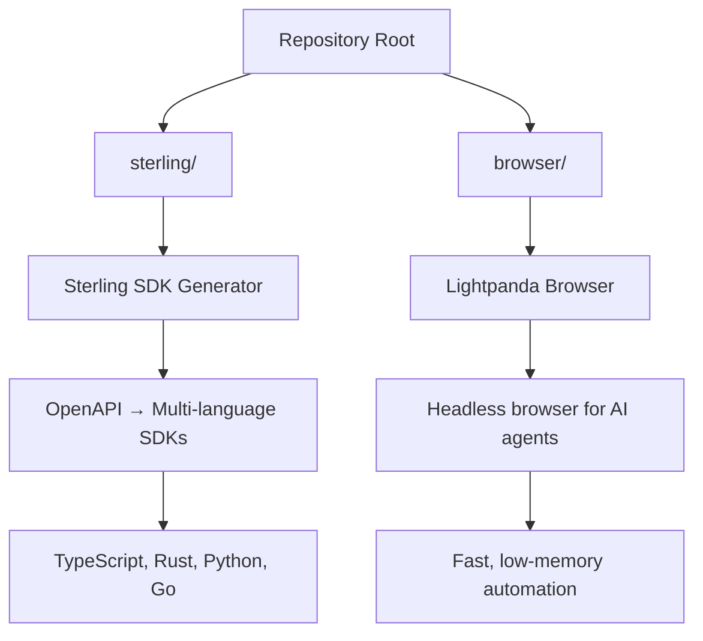
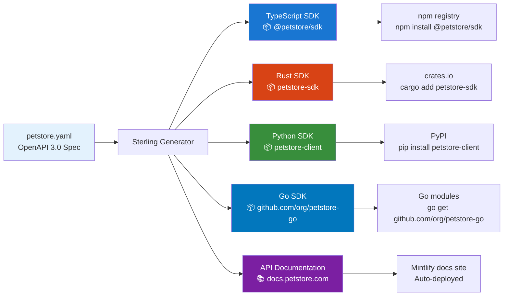

# Sterling - OpenAPI SDK Generator

Sterling is an open source replacement for Stainless, written in Zig. It generates SDKs across multiple programming languages from OpenAPI specifications.

## Overview

Sterling transforms your OpenAPI specifications into production-ready SDKs for multiple programming languages, with optional AI assistance for polishing and error handling.



## Core Workflow: OpenAPI to Multi-Language SDKs

The following diagram illustrates Sterling's primary function - converting OpenAPI specifications into multiple language-specific SDKs:



## Architecture

Sterling follows a modular architecture that separates parsing, generation, and output handling:



## SDK Generation Flow

The following sequence diagram shows how Sterling processes your OpenAPI specification through to final SDK deployment:



## Multi-Language Support Matrix

Sterling generates idiomatic code for each target language, respecting language-specific conventions and best practices:

```mermaid
graph TB
    subgraph "OpenAPI Features"
        A[REST Endpoints]
        B[Authentication<br/>• API Key<br/>• OAuth 2.0<br/>• Bearer Token]
        C[Request/Response Models]
        D[Error Handling]
        E[File Uploads]
        F[Webhooks]
    end
    
    subgraph "TypeScript SDK"
        G[• Fetch-based HTTP client<br/>• Full TypeScript types<br/>• ESM + CommonJS<br/>• Tree-shakeable<br/>• Browser + Node.js]
    end
    
    subgraph "Rust SDK"
        H[• reqwest HTTP client<br/>• serde serialization<br/>• async/await support<br/>• Error types<br/>• tokio runtime]
    end
    
    subgraph "Python SDK"
        I[• httpx async client<br/>• Pydantic models<br/>• Type hints<br/>• asyncio support<br/>• requests fallback]
    end
    
    subgraph "Go SDK"
        J[• net/http client<br/>• Struct types<br/>• Context support<br/>• Interface-based<br/>• Generics (Go 1.18+)]
    end
    
    A --> G
    A --> H
    A --> I
    A --> J
    
    B --> G
    B --> H
    B --> I
    B --> J
    
    C --> G
    C --> H
    C --> I
    C --> J
    
    D --> G
    D --> H
    D --> I
    D --> J
    
    E --> G
    E --> H
    E --> I
    E --> J
    
    F --> G
    F --> H
    F --> I
    F --> J
    
    style G fill:#3178c6,color:#fff
    style H fill:#ce422b,color:#fff
    style I fill:#3776ab,color:#fff
    style J fill:#00add8,color:#fff
```

## Configuration-Driven Generation

Sterling uses a declarative configuration approach to define how SDKs should be generated and where they should be published:



## LLM-Enhanced Code Generation

Sterling integrates with Large Language Models to enhance generated code quality and add intelligent error handling:



## Features

- **Multi-language SDK generation** (TypeScript, Rust, Python, Go)
- **Support for various authentication methods** (API Key, OAuth, Bearer Token)
- **Configurable output** to different GitHub repositories
- **Documentation generation** (Mintlify compatible)
- **LLM integration** for error handling and final touches
- **Deterministic builds** with optional AI assistance

## Usage

```bash
sterling generate --spec api.yaml --config sterling.toml
```

## Configuration

Create a `sterling.toml` file:

```toml
[targets.typescript]
language = "typescript"
repository = "https://github.com/org/typescript-sdk"
output_dir = "./generated/typescript"

[targets.rust]
language = "rust"
repository = "https://github.com/org/rust-sdk"
output_dir = "./generated/rust"

[targets.python]
language = "python"
repository = "https://github.com/org/python-sdk"
output_dir = "./generated/python"

[targets.go]
language = "go"
repository = "https://github.com/org/go-sdk"
output_dir = "./generated/go"

[llm]
provider = "anthropic"
api_key = "sk-..."
model = "claude-3-sonnet-20240229"

[output.docs]
format = "mintlify"
repository = "https://github.com/org/docs"
output_dir = "./generated/docs"
```

## Repository Structure

This repository contains two main projects:



### Sterling SDK Generator (`./sterling/`)
- OpenAPI specification parser and validator
- Multi-language code generators
- LLM integration for code improvement
- GitHub repository management
- Documentation generation

### Lightpanda Browser (`./browser/`)
- Headless browser built from scratch in Zig
- Ultra-low memory footprint (16x less than Chrome)
- Exceptionally fast execution (9x faster than Chrome)
- Compatible with Playwright, Puppeteer, chromedp through CDP

## Getting Started

1. **Install Sterling** (build from source or download binary)
2. **Prepare your OpenAPI spec** (`api.yaml` or `api.json`)
3. **Configure targets** in `sterling.toml`
4. **Generate SDKs**: `sterling generate --spec api.yaml --config sterling.toml`
5. **Deploy**: Sterling automatically pushes to configured GitHub repositories

## Example Output

From a simple Pet Store API specification, Sterling generates:



Each generated SDK includes:
- Type-safe request/response models
- Authentication handling
- Error handling and retries
- Comprehensive documentation
- Usage examples and tests

## Contributing

Sterling is open source and welcomes contributions. See the individual project directories for specific contribution guidelines.

## License

This project is licensed under the MIT License - see the LICENSE file for details.
