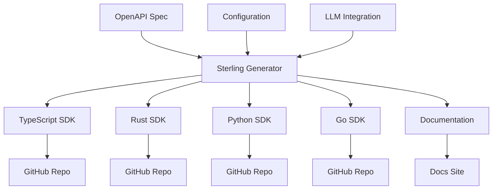
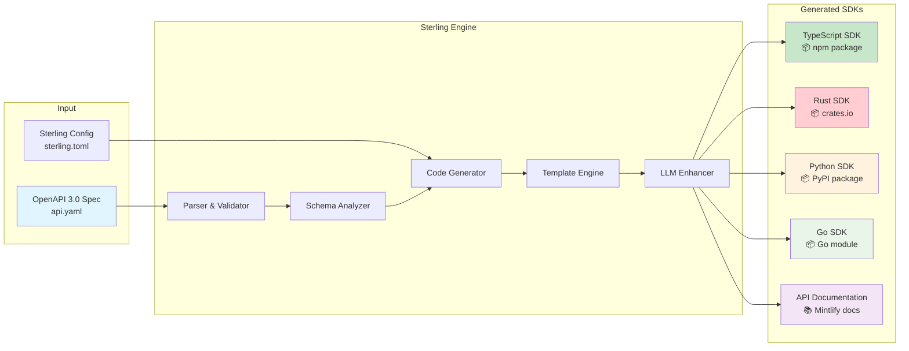
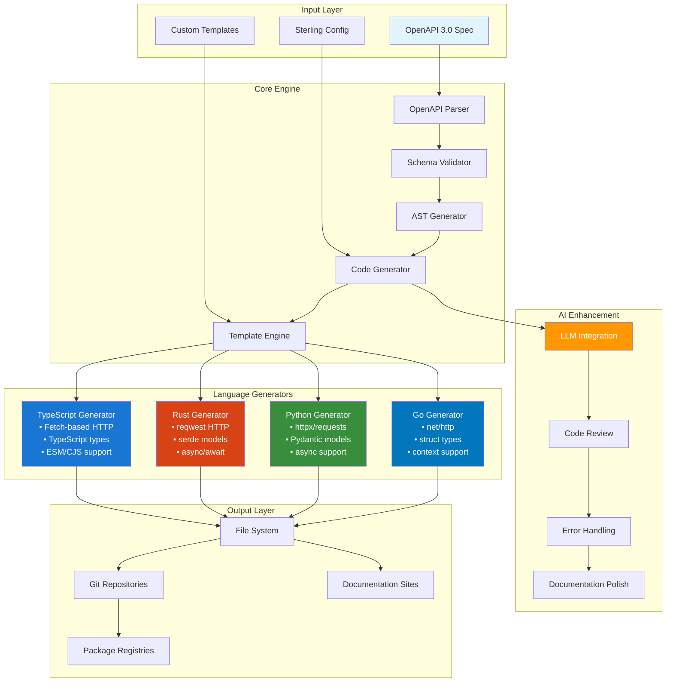
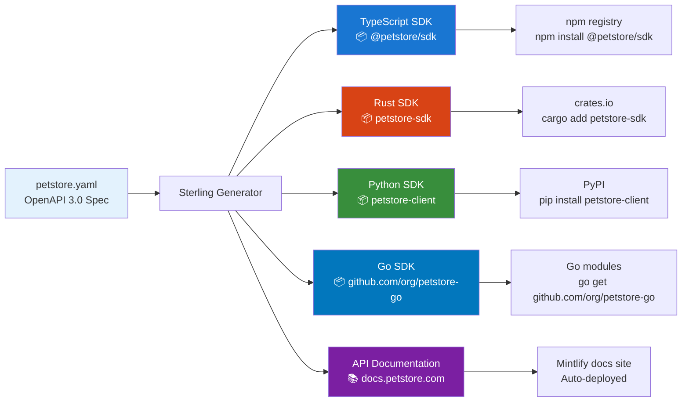

# Sterling - OpenAPI SDK Generator

Sterling is an open source replacement for Stainless, written in Zig. It generates SDKs across multiple programming languages from OpenAPI specifications.

## Overview

Sterling transforms your OpenAPI specifications into production-ready SDKs for multiple programming languages, with optional AI assistance for polishing and error handling.



## Core Workflow: OpenAPI to Multi-Language SDKs

The following diagram illustrates Sterling's primary function - converting OpenAPI specifications into multiple language-specific SDKs:



## Architecture

Sterling follows a modular architecture that separates parsing, generation, and output handling:



## Features

### Multi-Language Support
- **TypeScript**: Full type safety, ESM/CJS, Node.js + web
- **Rust**: async/await, serde integration, reqwest HTTP client
- **Python**: Pydantic models, httpx/requests, async support
- **Go**: Context support, standard library HTTP, struct types

### AI-Enhanced Generation
- LLM integration for code improvement
- Intelligent error handling patterns
- Documentation enhancement
- Code review and optimization

### Enterprise Ready
- GitHub repository automation
- Package registry publishing
- Comprehensive documentation generation
- CI/CD integration

## Installation

### From Source
```bash
git clone https://github.com/your-org/sterling
cd sterling
zig build -Doptimize=ReleaseFast
```

### Binary Download
Download the latest release from the [releases page](https://github.com/your-org/sterling/releases).

## Quick Start

1. **Create a configuration file** (`sterling.toml`):
```toml
[project]
name = "my-api"
version = "1.0.0"
description = "My API SDK"

[targets.typescript]
language = "typescript"
repository = "https://github.com/org/typescript-sdk"
output_dir = "./generated/typescript"

[targets.rust]
language = "rust"
repository = "https://github.com/org/rust-sdk"
output_dir = "./generated/rust"

[llm]
provider = "anthropic"
model = "claude-3-sonnet-20240229"
```

2. **Generate SDKs**:
```bash
sterling generate --spec api.yaml --config sterling.toml
```

3. **Deploy** (optional):
```bash
sterling deploy --config sterling.toml
```

## Configuration

Sterling uses TOML configuration files to define generation targets and options:

```toml
[project]
name = "petstore-api"
version = "1.0.0"
description = "Pet Store API SDK"
author = "Your Organization"
license = "MIT"

[targets.typescript]
language = "typescript"
repository = "https://github.com/org/typescript-sdk"
output_dir = "./generated/typescript"
package_name = "@petstore/sdk"

[targets.rust]
language = "rust"
repository = "https://github.com/org/rust-sdk"
output_dir = "./generated/rust"
package_name = "petstore-sdk"

[targets.python]
language = "python"
repository = "https://github.com/org/python-sdk"
output_dir = "./generated/python"

[targets.go]
language = "go"
repository = "https://github.com/org/go-sdk"
output_dir = "./generated/go"

[llm]
provider = "anthropic"
api_key = "sk-..."
model = "claude-3-sonnet-20240229"

[output.docs]
format = "mintlify"
repository = "https://github.com/org/docs"
output_dir = "./generated/docs"
```

## Repository Structure

```
sterling/
├── src/                    # Core Sterling implementation
│   ├── main.zig           # CLI entry point
│   ├── parser/            # OpenAPI parsing
│   ├── generator/         # Code generation
│   ├── languages/         # Language-specific generators
│   └── llm/              # LLM integration
├── templates/             # Code generation templates
├── examples/              # Example configurations
├── build.zig             # Zig build configuration
└── README.md             # This file
```

## Getting Started

1. **Install Sterling** (build from source or download binary)
2. **Prepare your OpenAPI spec** (`api.yaml` or `api.json`)
3. **Configure targets** in `sterling.toml`
4. **Generate SDKs**: `sterling generate --spec api.yaml --config sterling.toml`
5. **Deploy**: Sterling automatically pushes to configured GitHub repositories

## Example Output

From a simple Pet Store API specification, Sterling generates:



Each generated SDK includes:
- Type-safe request/response models
- Authentication handling
- Error handling and retries
- Comprehensive documentation
- Usage examples and tests

## Contributing

Sterling is open source and welcomes contributions. Please see our [contributing guidelines](CONTRIBUTING.md) for details on:

- Setting up the development environment
- Code style and conventions
- Testing requirements
- Pull request process

## License

This project is licensed under the MIT License - see the LICENSE file for details.
